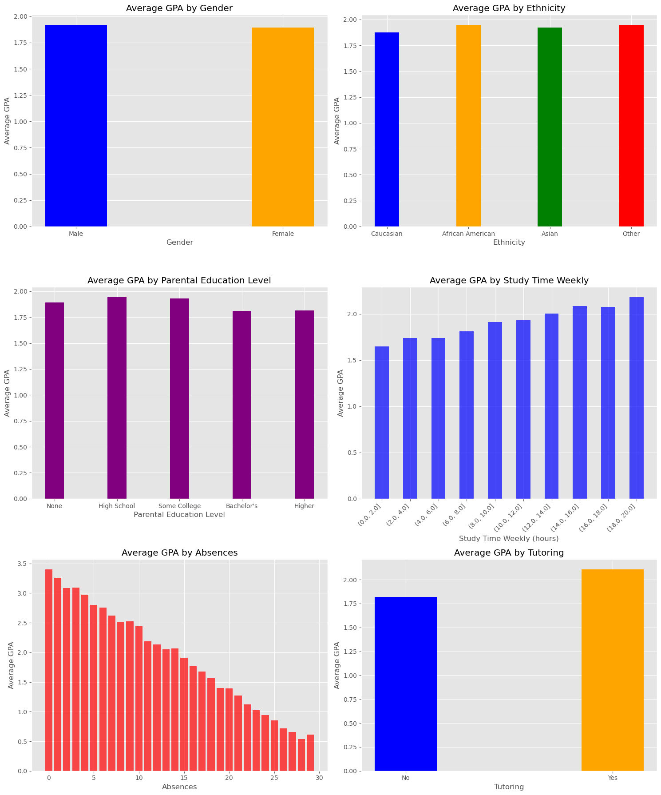
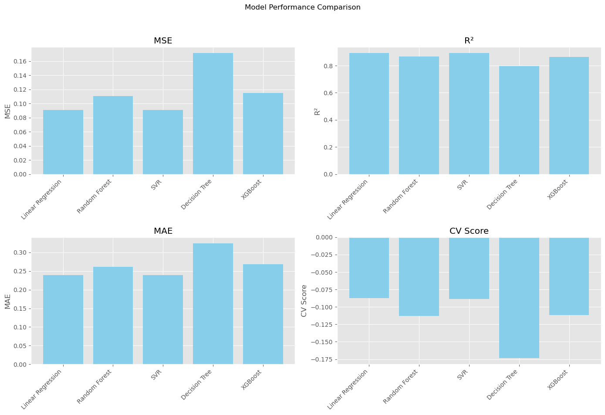

# MathProgrammingFinalProject
#### Mathematics and Programming(2024 Spring) Final Project

### 목차
1. 프로젝트 개요
2. 데이터 소개
3. 각 요인에 따른 GPA 시각화
4. 각 요인의 GPA에의 영향 여부 검정
5. GPA 예측 모델 생성 및 평가

### 1. 프로젝트 개요
2,392명의 고등학생들의 학업 성취도(GPA) 및 여러 학생 신상 정보를 담은 데이터를 통해 
여러 신상 정보 중 어떤 것이 GPA에 영향을 미치는 요인인지 가설 검정을 통해 확인하고
GPA에 영향을 미친다고 확인된 요인을 인자로 받아 GPA를 예측하는 모델을 생성하고 평가하는 프로젝트를 진행하려 한다.

### 2. 데이터 소개
***데이터 출처: <https://www.kaggle.com/datasets/rabieelkharoua/students-performance-dataset>***

데이터는 2392명의 고등학생들에 대한 다음 정보를 포함한다:
* StudentID : 각 학생에게 할당된 고유 식별자(1001~3392).
* Gender : 학생의 성별로, 0은 남성, 1은 여성
* Ethnicity : 학생의 인종
	* 0: 백인
	* 1: 아프리카계 미국인
	* 2: 아시아인
	* 3: 기타
* ParentalEducation : 부모의 교육 수준
	* 0: 없음
	* 1: 고등학교
	* 2: College
	* 3: 학사
	* 4: 그보다 높음
* StudyTimeWeekly : 0~20시간 범위의 주간 학습 시간
* Absenses : 학년도 중 결석 횟수(0~30회)
* Tutoring : 튜터링 상태로, 0은 아니오, 1은 예
* ParentalSupport : 부모의 지원 수준
	* 0: 없음
	* 1: 낮음
	* 2: 보통
	* 3: 높음
	* 4: 매우 높음
* Extracurricular : 과외 활동 참여 여부. 0은 아니요, 1은 예
* Sports : 스포츠 활동 참여 여부. 0은 아니요, 1은 예
* Music : 음악 활동 참여 여부. 0은 아니요, 1은 예
* Volunteering : 자원봉사 참여 여부. 0은 아니요, 1은 예
* GPA : 0.0에서 4.0 사이의 학업 성취도 평균

여러 신상 정보 중 Gender(성별), Ethnicity(인종), ParentalEducation(부모의 교육 수준), StudyTimeWeekly(주간 공부 시간), Absenses(연간 결석 횟수),
Tutoring(튜터링 여부)의 6가지 신상 정보가 GPA에 영향을 미치는지 시각화와 통계적 검정을 통해 알아보려 한다.

### 3. 각 요인에 따른 GPA 시각화

그래프를 보았을 때 성별, 인종, 부모의 교육 수준에 따른 GPA 차이는 두드러지지 않는다.
반대로 주간 공부 시간, 결석 횟수, 튜터링 여부와 GPA 사이에는 명확한 상관관계가 관찰된다.

### 4. 각 요인의 GPA에의 영향 여부 검정
이진 정보인 성별과 튜터링 여부에 대해서는 t-검정을, 여러 그룹으로 나뉘는 인종과 부모의 교육 수준에 대해서는 분산 분석을,
연속형 변수인 주간 공부 시간, 결석 횟수에 대해서는 피어슨 상관 분석을 진행해 각 요인의 GPA에의 영향 여부를 알아본다.
각 검정 결과의 p-값을 0.05와 비교해 다음과 같은 분석 결과를 얻었다:

---

Gender t-test: t=0.6531957576950806, p=0.5136929146255127

결과: 성별은 GPA에 유의미한 차이를 만들지 않습니다.

Ethnicity ANOVA: F=0.9581218945870755, p=0.4115850271925584

결과: 인종은 GPA에 유의미한 차이를 만들지 않습니다.

Parental Education ANOVA: F=1.8081303390687973, p=0.12448408765780827

결과: 부모의 교육 수준은 GPA에 유의미한 차이를 만들지 않습니다.

Study Time Pearson Correlation: r=0.1792751268560882, p=1.000201125924497e-18

결과: 주간 공부 시간은 GPA와 유의미한 상관 관계가 있습니다.

Absences Pearson Correlation: r=-0.9193135764208643, p=0.0

결과: 결석 횟수는 GPA와 유의미한 상관 관계가 있습니다.

Tutoring t-test: t=-7.170424050973337, p=9.923854014273352e-13

결과: 과외 여부는 GPA에 유의미한 차이를 만듭니다.

---

### 5. GPA 예측 모델 생성 및 평가
이 중 GPA에 영향을 준다고 판단된 주간 공부 시간, 결석 횟수, 과외 여부를 인자로 받아 GPA를 예측하는 모델을 생성하고자 한다.
다음 다섯 가지 모델을 생성하고 성능을 비교해 최적의 모델을 선정할 것이다:

* 선형 회귀 (Linear Regression)
* 랜덤 포레스트 회귀 (Random Forest Regressor)
* 서포트 벡터 회귀 (Support Vector Regressor, SVR)
* 결정 트리 회귀 (Decision Tree Regressor)
* XGBoost 회귀 (XGBRegressor)

모델의 성능은 다음의 평가 지표를 이용해 비교할 것이다:
* Mean Squared Error (MSE)
* R²
* Mean Absolute Error (MAE)
* Cross-Validation Score

다음은 모델의 평가 지표를 나타낸 그래프이다.

낮은 MSE와 MAE, 높은 R^2와 CV score를 가진 선형 회귀와 SVR이 나머지 세 모델에 비해 적합한 예측 모델로 판단된다.
